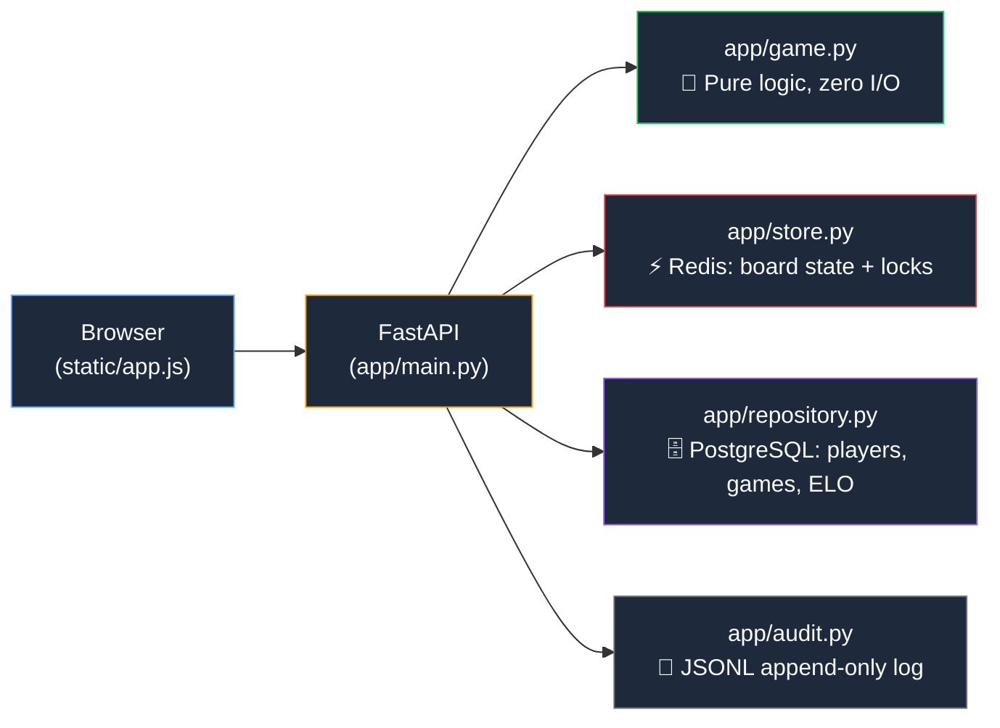
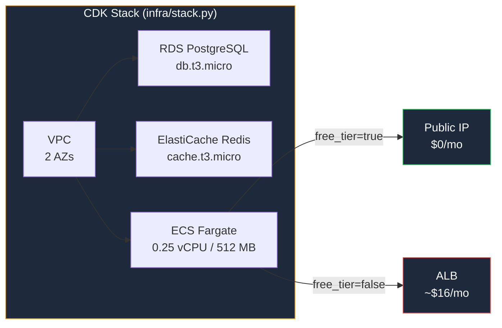
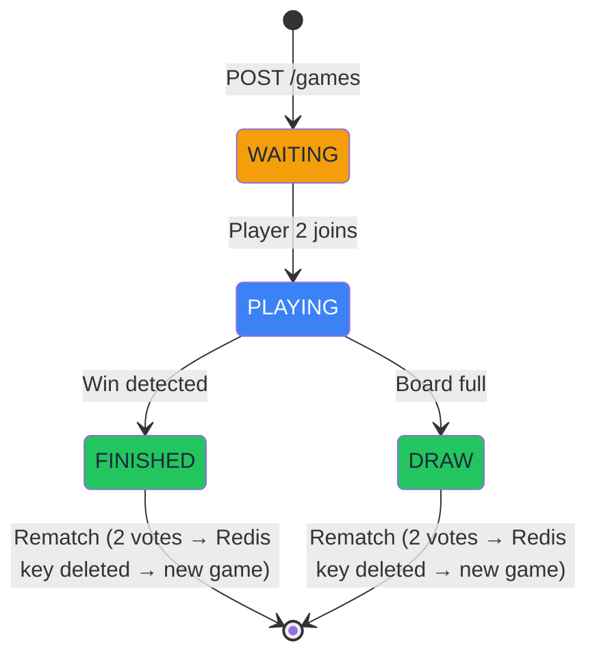

# Connect 4 Real-Time Prototype — AI Agent Instructions

## Architecture (3-Layer + Dual Data Path)



### Critical Design Rule — Dual Move Path


> **Do NOT** add DB persistence to REST move endpoints or remove it from WebSocket. This is intentional.

## File Map

| File | Responsibility |
|------|----------------|
| `app/main.py` | FastAPI app creation, router includes, startup/shutdown |
| `app/websocket.py` | WS endpoint: identify, move, rematch handling |
| `app/connection_manager.py` | In-memory WS room/player tracking |
| `app/game.py` | `Connect4` class — pure logic, O(1) win detection from last piece |
| `app/store.py` | `load_game`, `save_game`, `acquire_game_lock` (SETNX) |
| `app/repository.py` | All DB queries as module-level async functions |
| `app/db_models.py` | SQLAlchemy ORM: `PlayerModel`, `GameModel`, `MoveModel` |
| `app/models.py` | Pydantic request/response schemas |
| `app/database.py` | Engine, `async_session_factory`, `get_db` dependency |
| `app/audit.py` | JSONL writer with nanosecond timestamps |
| `app/routes/games.py` | CRUD + board state REST endpoints |
| `app/routes/players.py` | Player create/lookup/stats/active-game |
| `app/routes/matchmaking.py` | ELO-band queue: join, status, leave |
| `static/app.js` | All frontend JS (~1300 lines, single file) |
| `static/style.css` | All styles (~1035 lines, CSS variables + glassmorphism theme) |
| `static/index.html` | Single-page app shell |
| `infra/stack.py` | AWS CDK: Fargate + RDS + ElastiCache |

## Repository Pattern

**Functions, not a class.** All `app/repository.py` functions follow:

```python
async def create_game(session: AsyncSession, player1_id: uuid.UUID) -> GameModel:
    """..."""
    game = GameModel(player1_id=player1_id, status=GameStatus.WAITING)
    session.add(game)
    await session.flush()
    return game
```

- Never commit inside repository functions — the caller handles commit.
- REST endpoints use `Depends(get_db)` which auto-commits.
- WebSocket handler creates sessions with `async with async_session_factory() as db_session` and commits manually.

## WebSocket ConnectionManager (`app/connection_manager.py`)

Singleton in-memory manager with 4 dicts:

- `_rooms: dict[str, list[WebSocket]]` — game_id → connections
- `_player_map: dict[str, dict[WebSocket, int]]` — game → ws → player number
- `_usernames: dict[str, dict[int, str]]` — game → player → name
- `_rematch_votes: dict[str, set[int]]` — 2 votes triggers rematch

Client protocol messages: `{"player": 1, "column": 3}`, `{"action": "identify", ...}`, `{"action": "rematch", ...}`.
No Redis pub/sub — single-process only.

### WebSocket identity binding — critical gotcha

When a client sends `{"player": 1, "column": 0}` as its **first** message, that WebSocket
connection is **permanently bound** to player 1 (`app/websocket.py` lines ~51-53). Any subsequent
message from that socket claiming to be player 2 is rejected silently. This means:

- **In tests**: use two separate WS connections — `ws1` for P1 moves, `ws2` for P2 moves.
  Never send P2 moves from `ws1` or the test will hang forever.
- **Pattern for multi-move tests**:

  ```python
  moves = [(1, 0, ws1), (2, 6, ws2), (1, 1, ws1), ...]
  for player, column, sender in moves:
      sender.send_text(json.dumps({"player": player, "column": column}))
  ```

## Testing

Run: `pytest -v` (no Redis/PostgreSQL needed)

### Mock infrastructure in `tests/conftest.py`

- **`FakeRedis`** — hand-rolled in-memory class (not fakeredis library). Supports: `get`, `set`
  (with `nx`, `ex`), `delete`, `zadd`, `zrangebyscore`, `zrem`, `zrank`, `zcard`, `aclose`.
  Add new methods here if new Redis commands are used.
- **Mock DB**: `app.dependency_overrides[get_db]` yields `AsyncMock()`
- **Autouse fixture** `_reset_test_state`: clears FakeRedis + ConnectionManager between tests

### Two test styles

1. **Async HTTP** (`test_api.py`, `test_matchmaking.py`, `test_elo_and_stats.py`, ...):
   `httpx.AsyncClient` + `ASGITransport`, `@pytest.mark.anyio`
2. **Sync WebSocket** (`test_websocket_persistence.py`, `test_integration.py`): Starlette
   `TestClient`, `client.websocket_connect()`, `with patch(...)` context managers

### Mocking DB in WebSocket tests

```python
def _mock_session_factory(session: AsyncMock) -> MagicMock:
    @asynccontextmanager
    async def _factory():
        yield session
    return MagicMock(side_effect=_factory)

with patch("app.websocket.async_session_factory", new=_mock_session_factory(mock_db)):
    ...
```

Mock DB result objects use `SimpleNamespace`, not full ORM models.

### Common test failure causes

1. **Hanging test** — almost always a WS test sending a P2 move from `ws1`. The server rejects it
   silently; `ws2` blocks forever waiting for a broadcast that never arrives.
2. **FakeRedis missing method** — add it to `FakeRedis` in `conftest.py` if a new Redis command is used.
3. **Stale ConnectionManager state** — always clear it in `_reset_test_state`; check that fixture is present.

## Code Style

- **Python 3.13**, ruff with `line-length = 120`, rules: `E,F,W,I,N,UP,ANN,BLE,C4,RET,SIM`
- **`Final[type]`** for all constants: `MAX_RETRIES: Final[int] = 3`
- **Google-style docstrings** on all public functions
- **Exception variables**: `except Exception as exc:` — never single letters
- **Descriptive names**: `row_index` not `i`, `game_state` not `data`. Short names OK: `id`, `url`, `json`, `ws`, `db`
- **Early returns** / guard clauses — max 2 levels of nesting
- **File structure**: module docstring → imports → constants → types → functions → classes → entry point last

## Frontend (`static/app.js`)

Single-file vanilla JS (~1300 lines). Key globals:

```js
const state = {
    playerId, username, gameId, myPlayer,   // identity
    currentTurn, board, ws, gameOver,       // game state
    pollTimer,          // polls /games/{id}/status while waiting for opponent
    statsTimer,         // polls /stats every 30s on lobby
    matchmakingTimer,   // polls /matchmaking/status every 2s
    gamesRefreshTimer,  // auto-refreshes waiting games list every 5s on lobby screen
};
```

Screen flow: `screen-lobby` → `screen-games` (lobby) → `screen-game` → `screen-replay`

`gamesRefreshTimer` starts in `enterGameLobby()` and stops in `startGame()` / `replayGame()`.
Session state persisted to `sessionStorage` for page-refresh recovery.

## Developer Commands

```bash
# Local development
docker compose up --build          # Full stack on :8000
docker compose up --build -d api   # Rebuild only API (fast, keeps DB/Redis data)
pip install -e ".[dev]"            # Install with dev deps into .venv

# Quality
pytest -v                          # All 209 tests, no external deps, ~0.5s
ruff check app/ tests/             # Lint
ruff format app/ tests/            # Format

# Database migrations
alembic upgrade head               # Apply all migrations
alembic revision --autogenerate -m "description"  # Generate new migration

# AWS deployment (run from repo root)
cdk deploy                         # Deploy to AWS
```

## Deployment (AWS CDK)



- CDK app: `cdk.json` at repo root → `python3 infra/app.py`
- Always run `cdk deploy` from **repo root**, not from `infra/`
- GitHub Actions: `.github/workflows/deploy.yml` (manual `workflow_dispatch`)
- Secrets needed: `AWS_ACCESS_KEY_ID`, `AWS_SECRET_ACCESS_KEY`, `AWS_ACCOUNT_ID`

## Redis Key Schema

| Key pattern | Type | TTL | Purpose |
|-------------|------|-----|---------|
| `game:{game_id}` | String (JSON) | 24h | Board state (2D array) |
| `lock:{game_id}` | String (SETNX) | 5s | Distributed move lock |
| `matchmaking:queue` | Sorted set | — | ELO as score for band matching |
| `matchmaking:expiry:{player_id}` | String | 300s | TTL sentinel — absence means stale ghost entry |
| `matchmaking:result:{player_id}` | String (JSON) | 120s | Match result, consumed once on read |

**Matchmaking ghost prevention**: every `zadd` to the queue must be paired with
`set(expiry_key, "1", ex=300)`. Candidates missing their expiry key are evicted
silently — never matched.

## Game State Machine


