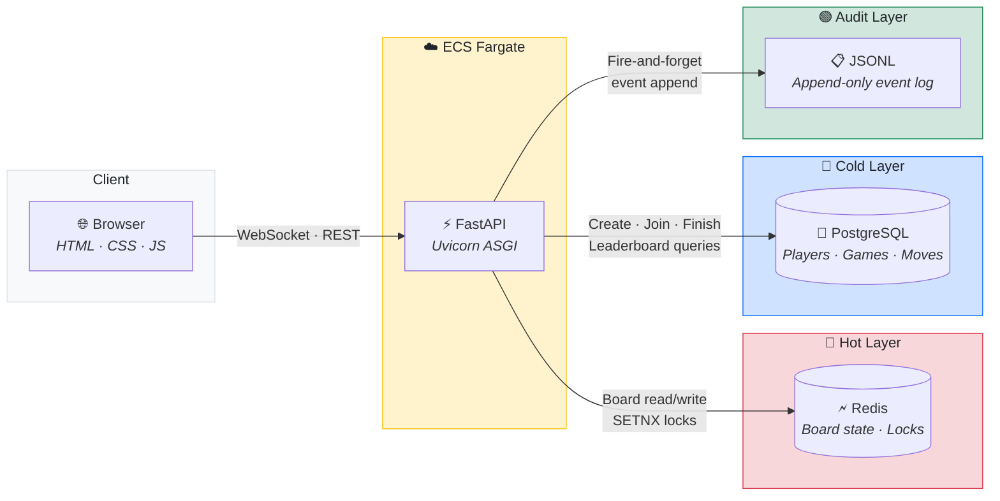
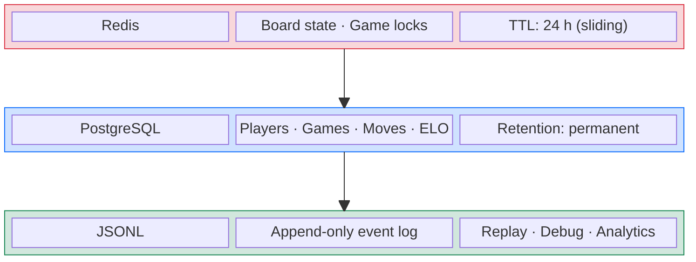
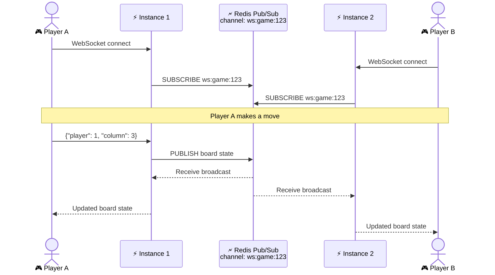

# Technical Decisions — Connect 4 Real-Time Prototype

> Architecture rationale — the **what**, **why**, and **how** behind every major technical decision.

---

## Architecture Overview



---

## Table of Contents

### 🏗️ Application & Architecture

1. [Language & Runtime](#1-language--runtime)
2. [Web Framework](#2-web-framework)
3. [Real-Time Communication](#3-real-time-communication)
4. [Data Architecture — Hot / Cold / Audit Split](#4-data-architecture--hot--cold--audit-split)
5. [Board Representation & Storage](#5-board-representation--storage)
6. [Win & Draw Detection Algorithm](#6-win--draw-detection-algorithm)
7. [Concurrency Control — Distributed Locking](#7-concurrency-control--distributed-locking)
8. [Database & ORM](#8-database--orm)
9. [Schema Migrations](#9-schema-migrations)
10. [Validation & Serialisation](#10-validation--serialisation)
11. [Audit Log — Event Sourcing Lite](#11-audit-log--event-sourcing-lite)

### 🚀 Operations & Deployment

12. [Containerisation & Local Development](#12-containerisation--local-development)
13. [Infrastructure as Code (AWS CDK)](#13-infrastructure-as-code-aws-cdk)
14. [AWS Service Choices — Why These and Not Others](#14-aws-service-choices--why-these-and-not-others)
15. [Scalability — Current Design & Growth Path](#15-scalability--current-design--growth-path)

### 🧹 Quality & Dependencies

16. [Code Quality Tooling](#16-code-quality-tooling)
17. [Dependency Summary](#17-dependency-summary)

---

## 1. Language & Runtime

| Choice          | Decision                      |
| --------------- | ----------------------------- |
| **Language**    | Python 3.13                   |
| **Async model** | `asyncio` (native coroutines) |

### Why Python 3.13

- **Productivity** — rapid prototyping with a rich ecosystem for web, data, and infra tooling.
- **Modern syntax** — the codebase uses `X | Y` union types (3.10), built-in generics like
  `list[str]` (3.9), `typing.Final` (3.8), and f-strings (3.6). Python 3.13 is the minimum
  version to stay current with performance and security patches.
- **Async-native** — `async/await` gives us non-blocking I/O for WebSockets, Redis, and PostgreSQL without threads or callbacks.

### Why not Node.js / Go / Rust?

Python was chosen for prototyping speed. The architecture (stateless HTTP + WebSocket with Redis
as shared state) is language-agnostic — it would port to any runtime if performance profiling
demanded it.

---

## 2. Web Framework

| Choice          | Decision                  |
| --------------- | ------------------------- |
| **Framework**   | FastAPI >= 0.133          |
| **ASGI server** | Uvicorn (standard extras) |

### Why FastAPI

- **Native WebSocket support** — first-class `@app.websocket()` decorator; no extra library needed.
- **Automatic OpenAPI docs** — every endpoint is documented at `/docs` out of the box.
- **Pydantic integration** — request/response validation is declarative and type-safe.
- **Dependency injection** — `Depends(get_db)` cleanly manages database session lifecycle per request.
- **Performance** — one of the fastest Python frameworks thanks to Starlette + Uvicorn.

### Why Uvicorn

Uvicorn is the recommended ASGI server for FastAPI. The `[standard]` extras include `uvloop` (faster event loop) and `httptools` (faster HTTP parsing).

---

## 3. Real-Time Communication

| Choice       | Decision                      |
| ------------ | ----------------------------- |
| **Protocol** | WebSocket (RFC 6455)          |
| **Endpoint** | `ws(s)://<host>/ws/{game_id}` |

### Why WebSocket over polling / SSE

- **Bidirectional** — players both send moves and receive opponent moves on the same connection.
- **Low latency** — no HTTP request/response overhead per move; the connection stays open.
- **Scalability path** — the current in-memory `ConnectionManager` can be replaced by a Redis
  Pub/Sub fan-out without changing the client protocol
  (see [Scalability](#15-scalability--current-design--growth-path)).

### How it works

1. Both players open a WebSocket to `/ws/{game_id}`.
2. A player sends `{"player": 1, "column": 3}`.
3. The server validates the move, updates Redis, and **broadcasts** the full board state to all connections in that game room.
4. Special `{"action": "rematch"}` messages trigger a two-vote rematch flow.

### Connection lifecycle

The `ConnectionManager` class maintains a `dict[str, list[WebSocket]]` mapping game IDs to active
sockets. Dead connections are detected on broadcast failure and pruned automatically.

---

## 4. Data Architecture — Hot / Cold / Audit Split

The system splits data into three layers, each optimised for its access pattern:



### Why this split

| Layer                 | Concern                                  | Why not just PostgreSQL?                                                                                                                                                                                                            |
| --------------------- | ---------------------------------------- | ----------------------------------------------------------------------------------------------------------------------------------------------------------------------------------------------------------------------------------- |
| **Hot (Redis)**       | Board state during active play           | Sub-millisecond reads; a SQL query per move adds ~2–5 ms latency and unnecessary write-ahead log pressure.                                                                                                                          |
| **Cold (PostgreSQL)** | Durable player/game records, leaderboard | Relational integrity (FK constraints), complex queries (leaderboard, history), ACID guarantees.                                                                                                                                     |
| **Audit (JSONL)**     | Immutable event stream                   | Append-only, no schema constraints; decoupled from the request path (see [Section 11](#11-audit-log--event-sourcing-lite) and [Section 15 Phase 3](#phase-3--global-scale-1-000-concurrent-games) for the production upgrade path). |

---

## 5. Board Representation & Storage

### In-memory representation

The board is a **6×7 two-dimensional list of integers**:

```python
board: list[list[int]]  # board[row][col]
```

| Value | Meaning          |
| ----- | ---------------- |
| `0`   | Empty cell       |
| `1`   | Player 1's piece |
| `2`   | Player 2's piece |

**Row 0 is the top row; row 5 is the bottom.** Gravity is simulated by scanning from
`row = ROWS - 1` (bottom) upward to find the lowest empty cell in a column (`_lowest_empty_row`).

Example — a board mid-game:

```text
row 0: [0, 0, 0, 0, 0, 0, 0]   ← top (last to fill)
row 1: [0, 0, 0, 0, 0, 0, 0]
row 2: [0, 0, 0, 0, 0, 0, 0]
row 3: [0, 0, 0, 2, 0, 0, 0]
row 4: [0, 0, 1, 1, 0, 0, 0]
row 5: [0, 1, 2, 2, 1, 0, 0]   ← bottom (fills first)
```

### Why a 2D integer matrix (not a JSON object / dictionary)

A dictionary-based representation (e.g., `{"3,4": 1, "4,3": 2}`) was considered and rejected. The tradeoffs:

| Concern       | `list[list[int]]` (chosen)                         | `dict` / JSON object                                              |
| ------------- | -------------------------------------------------- | ----------------------------------------------------------------- |
| Cell access   | `board[row][col]` — O(1), no overhead              | `board.get(f"{row},{col}", 0)` — key construction on every access |
| Win detection | Direct index arithmetic in the direction walk loop | String key building on every step (`f"{r+dr},{c+dc}"`)            |
| Gravity scan  | `for row in range(5, -1, -1): board[row][col]`     | Must probe keys or maintain separate column-height tracking       |
| Board density | Always 42 cells — the grid is dense by nature      | Sparse dicts save space for large/empty boards; 42 cells is tiny  |
| JSON payload  | ~120 bytes, no key overhead                        | String keys add ~30–50% size for zero benefit                     |
| Frontend      | `board[r][c]` maps directly to CSS grid rendering  | Extra parsing step to reconstruct the visual grid                 |

**Bottom line**: dictionaries shine for sparse, large, or variable-sized structures (chess variants,
Go boards). Connect 4 is the opposite — **small (6×7), fixed-size, and dense** (empty cells matter
for gravity and draw logic). The list _is_ the natural shape of a grid.

Additional advantages of the chosen approach:

- **Simplicity** — direct row/column indexing with `O(1)` access.
- **Serialisation** — `json.dumps(board)` produces a compact, human-readable JSON array of arrays — no custom encoder needed.
- **Universality** — the same representation works in Python (game engine), Redis (JSON string), and JavaScript (frontend rendering).

### How the board is stored in Redis

```text
Key:    game:{game_id}
Value:  "[[0,0,0,...],[0,0,0,...],...]"   (JSON string)
TTL:    86 400 s (24 h, sliding on every save)
```

- **`save_game`** serialises the board with `json.dumps(game.board)` and writes it with a sliding TTL.
- **`load_game`** deserialises with `json.loads(raw)` and reconstructs a `Connect4` instance.
- If the key does not exist (first move or TTL expired), a fresh empty board is created.

### Why JSON in Redis (not a hash or bitfield)

- The entire board is always read and written atomically — no partial updates.
- JSON is human-debuggable via `redis-cli GET game:<id>`.
- The payload is tiny (~120 bytes) — there is no benefit to a more compact encoding.

---

## 6. Win & Draw Detection Algorithm

### Win detection — O(1) localised check

After every move, we only check whether **the piece just placed** forms a line of 4. This is
`O(WIN_LENGTH)` per direction, with 4 directions total — effectively `O(1)` constant-time
regardless of board size.

**Directions checked** (defined in `_DIRECTIONS`):

| Direction  | `(dr, dc)` | Meaning                 |
| ---------- | ---------- | ----------------------- |
| Horizontal | `(0, 1)`   | Left ↔ Right            |
| Vertical   | `(1, 0)`   | Up ↕ Down               |
| Diagonal ↘ | `(1, 1)`   | Top-left ↔ Bottom-right |
| Diagonal ↗ | `(1, -1)`  | Bottom-left ↔ Top-right |

**Algorithm**:

```text
For each direction (dr, dc):
    count = 1  (the piece itself)
    Walk in the positive direction (r+dr, c+dc) while cells match → count++
    Walk in the negative direction (r-dr, c-dc) while cells match → count++
    If count >= 4 → win detected
```

This approach avoids scanning the full board (which would be `O(ROWS × COLS × WIN_LENGTH)`) and is the standard efficient solution for Connect 4.

### Draw detection

A draw is detected when **the top row (row 0) is completely filled** and no winner has been
found. Since pieces stack from the bottom, a full top row means the entire board is full:

```python
def _check_draw(self) -> bool:
    return all(self.board[0][c] != 0 for c in range(COLS))
```

### Board reconstruction from persistence

When loading a board from Redis, `_recompute_terminal` scans all occupied cells to determine:

1. Whether the game already has a winner (by running `_check_win` on every placed piece).
2. Whether the game is a draw.
3. Whose turn it is (derived from the total piece count: even → Player 1, odd → Player 2).

This is only called once at load time — not on every move.

---

## 7. Concurrency Control — Distributed Locking

### The problem

Two players could send moves at the same instant. Without locking, both requests could read the
same board state, apply their moves independently, and overwrite each other — corrupting the game.

### The solution — Redis SETNX lock

```text
Key:    lock:{game_id}
Value:  "1"
NX:     Only set if the key does not already exist
EX:     5-second auto-expiry (deadlock prevention)
```

The `acquire_game_lock` function uses an async context manager:

1. `SET lock:{game_id} "1" NX EX 5` — atomic acquire.
2. If acquired (`True`), the caller processes the move.
3. On exit, `DELETE lock:{game_id}` — release.
4. If not acquired (`False`), the endpoint returns **409 Conflict** ("Another move is being processed").

### Why SETNX over Redlock / database locks

- **Single Redis node** — SETNX is correct and sufficient for a single-node deployment.
- **No Lua scripts** — keeps the Redis interaction simple and debuggable.
- **Auto-expiry** — prevents deadlocks if the holder crashes.
- **Upgrade path** — scaling to a Redis cluster means switching to Redlock with no API changes (see [Section 15 Phase 2](#phase-2--high-availability-100-1-000-concurrent-games)).

---

## 8. Database & ORM

| Choice       | Decision                             |
| ------------ | ------------------------------------ |
| **Database** | PostgreSQL 17                        |
| **Driver**   | `asyncpg` (pure async)               |
| **ORM**      | SQLAlchemy 2.x (2.0-style async API) |

### Why PostgreSQL

- **Relational integrity** — foreign keys between `players`, `games`, and `moves` tables.
- **ACID transactions** — game creation, joining, and finishing are transactional.
- **JSON support** — PostgreSQL has native JSONB for structured column data if needed.
- **Free Tier** — RDS `db.t3.micro` is free for 12 months.

### Why SQLAlchemy 2.x async

- **Mapped columns** — type-safe ORM models with `Mapped[type]` annotations.
- **Async sessions** — non-blocking queries via `asyncpg`, matching the rest of the async stack.
- **Repository pattern** — all queries are isolated in `repository.py`, keeping the API layer clean.

### Schema overview

```text
players                  games                    moves
────────                 ────────                 ────────
id (UUID PK)             id (UUID PK)             id (UUID PK)
username (unique)        player1_id (FK)          game_id (FK, indexed)
elo_rating (int)         player2_id (FK, null)    player (1 or 2)
created_at               status (enum)            column (int)
                         winner_id (FK, null)     row (int)
                         created_at               move_number (int)
                         finished_at              created_at
```

The `moves` table enables **full game replay** — given a game ID, you can reconstruct the entire match move by move.

---

## 9. Schema Migrations

| Choice   | Decision        |
| -------- | --------------- |
| **Tool** | Alembic >= 1.18 |

### Why Alembic

- **SQLAlchemy-native** — shares the same model definitions; no schema duplication.
- **Versioned migrations** — each change is a numbered script (`001_initial_schema.py`).
- **Automatic on deploy** — `entrypoint.sh` runs `alembic upgrade head` before starting Uvicorn, ensuring the database schema is always up to date.

---

## 10. Validation & Serialisation

| Choice      | Decision    |
| ----------- | ----------- |
| **Library** | Pydantic v2 |

### Why Pydantic

- **FastAPI integration** — request bodies and response models are validated automatically.
- **Declarative constraints** — `Field(..., ge=0, lt=7)` for column validation; `field_validator` for custom rules.
- **ORM compatibility** — `model_config = {"from_attributes": True}` allows direct conversion from SQLAlchemy models.

### Key validation rules

| Field     | Rule                               | Enforcement                 |
| --------- | ---------------------------------- | --------------------------- |
| `player`  | Must be `1` or `2`                 | `Field(..., ge=1, le=2)`    |
| `column`  | Must be `0–6`                      | `Field(..., ge=0, lt=COLS)` |
| `game_id` | Alphanumeric + hyphens/underscores | `@field_validator`          |

---

## 11. Audit Log — Event Sourcing Lite

Every move (REST and WebSocket) appends a JSON-lines record to `events.log`:

```json
{"ts": 1740700800000000000, "event": "MOVE_WS", "game_id": "abc-123", "player": 1, "column": 3, "row": 5, "winner": null, "draw": false}
```

### Why append-only JSONL

- **Immutable** — events are never updated or deleted; this is a fundamental event-sourcing property.
- **Nanosecond timestamps** — `time.time_ns()` provides a unique, sortable ordering key suitable for idempotent replay.
- **Decoupled** — the audit write is fire-and-forget; it does not participate in the Redis transaction.
- **Production upgrade path** — replace the file writer with a Kafka/Kinesis producer; the event
  schema stays the same
  (see [Section 15 Phase 3](#phase-3--global-scale-1-000-concurrent-games) for details).

### Event types

| Event     | Trigger                           |
| --------- | --------------------------------- |
| `MOVE`    | REST `POST /games/{game_id}/move` |
| `MOVE_WS` | WebSocket move message            |

---

## 12. Containerisation & Local Development

| Choice                    | Decision           |
| ------------------------- | ------------------ |
| **Container runtime**     | Docker             |
| **Orchestration (local)** | Docker Compose     |
| **Base image**            | `python:3.13-slim` |

### Docker Compose services

| Service    | Image                   | Port | Purpose             |
| ---------- | ----------------------- | ---- | ------------------- |
| `postgres` | `postgres:17-alpine`    | 5432 | Cold data layer     |
| `redis`    | `redis:8-alpine`        | 6379 | Hot data layer      |
| `api`      | Built from `Dockerfile` | 8000 | FastAPI application |

### Why Docker Compose

- **One command** — `docker compose up` starts the entire stack with health checks and dependency ordering.
- **Environment parity** — the same container image runs locally and on AWS ECS Fargate.
- **Volume persistence** — PostgreSQL data survives container restarts via a named volume.

---

## 13. Infrastructure as Code (AWS CDK)

| Choice       | Decision                                        |
| ------------ | ----------------------------------------------- |
| **IaC tool** | AWS CDK (Python)                                |
| **Target**   | AWS Free Tier (ECS Fargate + RDS + ElastiCache) |

### Why CDK over Terraform / CloudFormation

- **Same language** — the infrastructure is defined in Python, matching the application code.
- **High-level constructs** — `ApplicationLoadBalancedFargateService` provisions an ALB, ECS
  service, task definition, security groups, and log group in a single construct.
- **Asset bundling** — CDK builds and pushes the Docker image to ECR automatically during `cdk deploy`.

See [docs/AWS_DEPLOYMENT.md](AWS_DEPLOYMENT.md) for step-by-step deployment instructions.

---

## 14. AWS Service Choices

Every service was chosen for free-tier eligibility, managed simplicity, and alignment with the
app's architecture. The application only speaks to PostgreSQL and Redis — not AWS APIs — so only
`infra/stack.py` and `entrypoint.sh` are AWS-specific.

| Service               | Role                | Rationale                                                                                             |
| --------------------- | ------------------- | ----------------------------------------------------------------------------------------------------- |
| **ECS Fargate**       | Container compute   | WebSocket-capable, no server management, free for 750 hrs/mo                                          |
| **RDS PostgreSQL**    | Relational database | Data is inherently relational (players → games → moves); full SQL needed for leaderboard queries      |
| **ElastiCache Redis** | Hot state + locking | Sub-ms reads on every move; native `SETNX` for distributed locks; built-in Pub/Sub for future fan-out |
| **ALB**               | Load balancer       | Native WebSocket upgrade handling; HTTP health checks; sticky-session ready for scale-out             |
| **ECR**               | Container registry  | CDK `ContainerImage.from_asset()` builds and pushes automatically — no manual `docker push`           |
| **VPC**               | Network isolation   | RDS and Redis in private isolated subnets; no NAT Gateway needed ($0/mo)                              |
| **Secrets Manager**   | Credential storage  | CDK auto-generates RDS credentials; ECS injects them at runtime — never appear in source code         |
| **CloudWatch Logs**   | Application logging | Zero-config with Fargate; `aws_logs` driver streams stdout/stderr automatically                       |

---

## 15. Scalability — Current Design & Growth Path

### Current state (single-instance prototype)

The prototype runs on **one ECS Fargate task** (0.25 vCPU, 512 MB RAM). This handles the expected prototype workload comfortably.

#### Already built for scale

| Concern              | Current solution                           | Why it scales                                                                             |
| -------------------- | ------------------------------------------ | ----------------------------------------------------------------------------------------- |
| **Board state**      | Redis (shared, external)                   | Any number of application instances can read/write the same game state.                   |
| **Move concurrency** | Redis SETNX lock                           | Distributed lock works across multiple app instances — not tied to process memory.        |
| **Persistent data**  | PostgreSQL (external)                      | Decoupled from the app process; supports connection pooling, replicas, and multi-AZ.      |
| **API layer**        | Stateless FastAPI (except WebSocket rooms) | Horizontally scalable behind a load balancer for REST endpoints.                          |
| **Audit events**     | Append-only log                            | Can be swapped to a distributed stream (Kafka/Kinesis) without changing the event schema. |

### Growth path — what to change at each scale milestone

#### Phase 1 — Multiple app instances (10–100 concurrent games)

| Change                                  | Why                                                                                                                                                                            | How                                                                                                                                                                                           |
| --------------------------------------- | ------------------------------------------------------------------------------------------------------------------------------------------------------------------------------ | --------------------------------------------------------------------------------------------------------------------------------------------------------------------------------------------- |
| **Redis Pub/Sub for WebSocket fan-out** | The in-memory `ConnectionManager` only knows about connections on its own process. With multiple instances behind an ALB, Player A and Player B may land on different servers. | Each instance subscribes to a Redis channel per game. On a move, the handler publishes the broadcast payload to the channel; all subscribers forward it to their local WebSocket connections. |
| **ALB sticky sessions**                 | Ensure a WebSocket upgrade request reaches the same task for the duration of the connection.                                                                                   | Enable stickiness on the ALB target group (cookie-based or connection-based).                                                                                                                 |
| **ECS auto-scaling**                    | Handle traffic spikes without manual intervention.                                                                                                                             | Target-tracking policy on CPU or request count; `desired_count` scales between 1 and N.                                                                                                       |

#### Phase 2 — High availability (100–1 000 concurrent games)

| Change                       | Why                                                       | How                                                                                                                              |
| ---------------------------- | --------------------------------------------------------- | -------------------------------------------------------------------------------------------------------------------------------- |
| **RDS Multi-AZ**             | Automatic failover if the primary database goes down.     | Enable `multi_az=True` in the CDK stack.                                                                                         |
| **RDS read replicas**        | Offload leaderboard and history queries from the primary. | Add read replicas; route read-only queries to the replica endpoint.                                                              |
| **ElastiCache cluster mode** | Multiple Redis shards for higher throughput.              | Enable cluster mode in ElastiCache; use hash-tag-based key sharding (`{game_id}`) so game keys and locks land on the same shard. |
| **Upgrade SETNX to Redlock** | SETNX is not safe across multiple Redis nodes.            | Switch to `redis.asyncio.lock.Lock` which implements the Redlock algorithm.                                                      |

#### Phase 3 — Global scale (1 000+ concurrent games)

| Change                              | Why                                                                         | How                                                                                           |
| ----------------------------------- | --------------------------------------------------------------------------- | --------------------------------------------------------------------------------------------- |
| **Audit → Kinesis / Kafka**         | File-based audit does not survive container restarts and cannot be queried. | Publish events to Kinesis Data Firehose → S3 → Athena for analytics.                          |
| **ELO computation as async worker** | Avoid blocking the request path with rating calculations.                   | Publish a `GAME_FINISHED` event; a separate worker consumes it and updates ELO in PostgreSQL. |
| **CDN for static assets**           | Reduce ALB load and improve global latency.                                 | Serve `static/` via CloudFront (1 TB/mo free).                                                |
| **HTTPS**                           | Encrypt all traffic in transit.                                             | ACM certificate (free) + ALB HTTPS listener.                                                  |

### WebSocket scalability — deep dive

The core challenge is that **WebSocket connections are stateful**. The current `ConnectionManager`
holds connections in a Python `dict` — this works for a single process but breaks with multiple
instances.

The planned solution:



This pattern is well-established (Socket.IO uses it with its Redis adapter) and requires no client-side changes.

---

## 16. Code Quality Tooling

| Tool           | Purpose                                            | Configuration                                               |
| -------------- | -------------------------------------------------- | ----------------------------------------------------------- |
| **Ruff**       | Linter + formatter (replaces Black, isort, Flake8) | `pyproject.toml` — 120 char line length, Python 3.13 target |
| **pytest**     | Test runner                                        | Async mode via `pytest-anyio`                               |
| **pre-commit** | Git hooks for automated checks                     | Runs Ruff on every commit                                   |
| **Type hints** | Static analysis (mypy-compatible)                  | Enforced by Ruff rules `ANN`                                |

### Ruff lint rules enabled

| Rule set      | What it catches                      |
| ------------- | ------------------------------------ |
| `E`, `F`, `W` | Core pycodestyle and pyflakes errors |
| `I`           | Import sorting                       |
| `N`           | PEP 8 naming conventions             |
| `UP`          | Python version upgrade opportunities |
| `ANN`         | Missing type annotations             |
| `BLE`         | Blind exception catching             |
| `C4`          | Unnecessary comprehension patterns   |
| `RET`         | Unnecessary return statements        |
| `SIM`         | Simplifiable code patterns           |

---

## 17. Dependency Summary

### Runtime dependencies

| Package               | Version   | Why                                                              |
| --------------------- | --------- | ---------------------------------------------------------------- |
| `fastapi`             | >= 0.133  | Web framework with WebSocket, OpenAPI, and Pydantic integration  |
| `uvicorn[standard]`   | >= 0.41   | ASGI server with uvloop and httptools for production performance |
| `pydantic`            | >= 2.12   | Request/response validation and serialisation                    |
| `sqlalchemy[asyncio]` | >= 2.0.47 | Async ORM for PostgreSQL with type-safe mapped columns           |
| `asyncpg`             | >= 0.31   | High-performance async PostgreSQL driver                         |
| `redis`               | >= 7.2    | Async Redis client (`redis.asyncio`) for board state and locking |
| `alembic`             | >= 1.18   | Database schema migrations                                       |

### Dev dependencies

| Package        | Version | Why                                              |
| -------------- | ------- | ------------------------------------------------ |
| `pytest`       | >= 9.0  | Test framework                                   |
| `pytest-anyio` | >= 0.0  | Async test support (trio + asyncio)              |
| `anyio[trio]`  | >= 4.12 | Backend for async test execution                 |
| `httpx`        | >= 0.28 | Async HTTP client for integration tests          |
| `ruff`         | 0.15.4  | Linter and formatter (pinned for CI consistency) |
| `pre-commit`   | >= 4.5  | Git hook management                              |

### Infrastructure dependencies

| Package       | Why                                    |
| ------------- | -------------------------------------- |
| `aws-cdk-lib` | CDK constructs for all AWS resources   |
| `constructs`  | Base construct library required by CDK |
